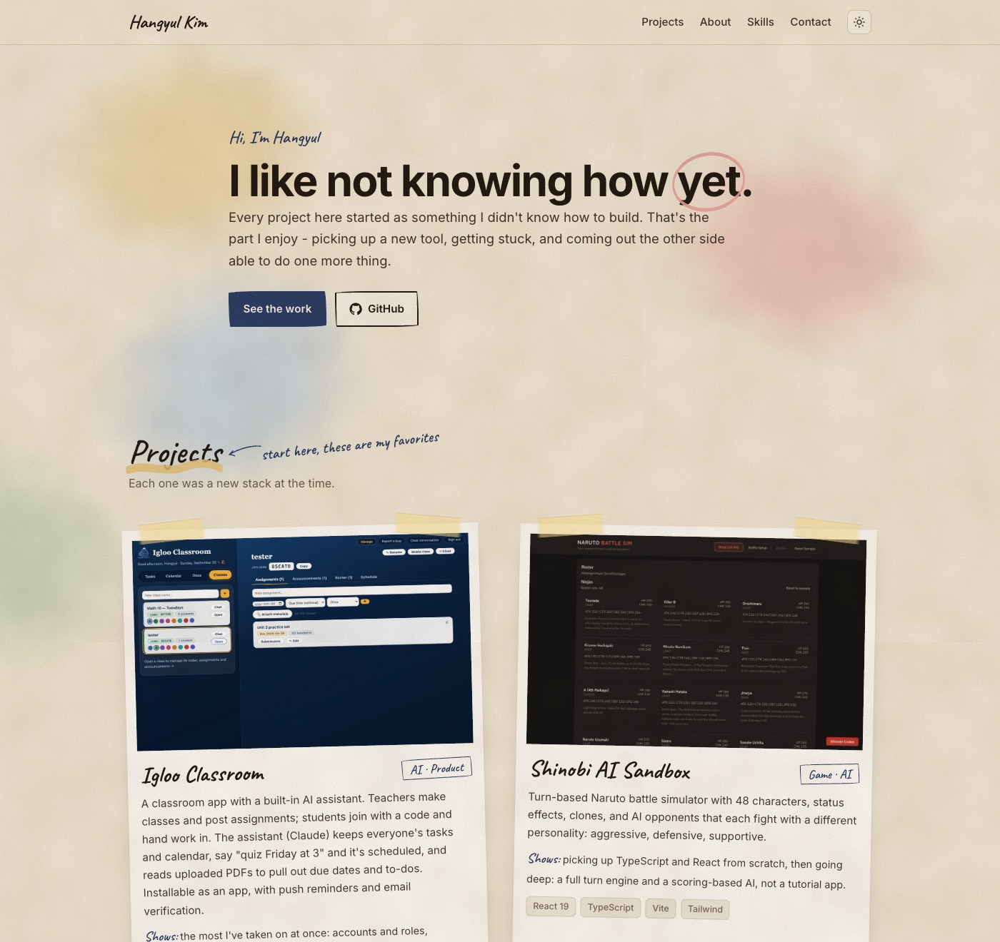

<b><a href="https://hangyulkimmy.github.io">hangyulkimmy.github.io</a></b> is the full version. Below is the short one.

# Hi, I'm Hangyul Kim

Every project here started as something I didn't know how to build yet. That's the part I enjoy.
Everything below has a live link or runnable code.

**[hangyulkimmy.github.io](https://hangyulkimmy.github.io)** · h239kim@uwaterloo.ca · 778-955-2006

---

## Featured projects

| Project | What it is | What it shows | Stack |
|---|---|---|---|
| **[Igloo Classroom](https://igloo-assistant.up.railway.app)** · [Try it](https://igloo-assistant.up.railway.app/signup) | Classroom app with a built-in AI assistant: teachers post assignments, students join by code, the assistant (Claude) manages tasks/calendar and reads uploaded PDFs for due dates. Installable PWA with push reminders. Live with real students. *Code private, on request.* | Accounts & roles, streaming AI with tool use, uploads, email, push | Node · Express · Claude API · Web Push · Railway |
| **[Shinobi AI Sandbox](https://github.com/hangyulkimmy/shinobi-ai-sandbox)** · [Play](https://hangyulkimmy.github.io/shinobi-ai-sandbox/) | Turn-based Naruto battle simulator with 48 characters, status effects, clones, and AI opponents that each have a fighting "personality" | Game engine design, AI decision scoring, typed state management | React 19 · TypeScript · Vite · Tailwind |
| **[Coup Online](https://github.com/hangyulkimmy/coup-online)** | Online multiplayer Coup, 4-letter room codes, bluffing, challenges, refresh-safe rejoin, optional Inquisitor expansion and turn timer | Real-time networking, server-authoritative game logic | Node · Express · Socket.IO |
| **[Igloo Study](https://github.com/hangyulkimmy/igloo-study)** · [Try the tester](https://hangyulkimmy.github.io/igloo-study/Igloostudy-tester/) | Test-taking platform for a tutoring service I run: students take level tests in the browser, admins upload/edit tests and review submissions | Keeping a real product running for real users; REST API + DB + file storage | Node · Express · PostgreSQL · Cloudinary |
| **[One Device Mafia](https://github.com/hangyulkimmy/onedevicemafia)** · [Play](https://hangyulkimmy.github.io/onedevicemafia/) | Pass-the-phone Mafia party game, no accounts, no second device | UX for a shared-screen game, state flow | JavaScript · Vite |

## Games (Unity → WebGL, playable in-browser)

[Asteroids](https://hangyulkimmy.github.io/asteroids/) · [Breakout](https://hangyulkimmy.github.io/Breakout/) · [Pong](https://hangyulkimmy.github.io/pong/) · [CleanUp Covid](https://hangyulkimmy.github.io/covid/) · [Blackjack](https://hangyulkimmy.github.io/BlackJack/) (App Lab)

## Tech I use

**Frontend:** TypeScript, React, Vite, Tailwind, vanilla JS/HTML/CSS
**Backend:** Node, Express, Socket.IO, PostgreSQL, REST APIs, Claude API
**Games:** Unity (C#), custom turn-based engines, game AI
**Tools:** Git/GitHub, GitHub Pages, Render, Railway, Cloudinary

<!--
Optional, GitHub stats card. Uncomment if you like the look:

-->
